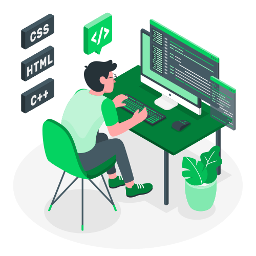

 
  Olá meu nome é João, sou desenvolvedor de <strong>Front-End</strong> e <strong>UX Designer</strong>. Estudante de Ciências da Computação e cursando o 5°semestre. Estou
procurando um estágio a fim de obter experiência e desenvolver meus
conhecimentos na área.

Me interesso principalmente pelas tecnologias <strong>HTML5,
<strong>CSS3</strong>, <strong>JS</strong>, <strong>React</strong> e <strong>NodeJs</strong>, mas estou sempre disposto a aprender novas
tecnologias e aberto a oportunidades. Caso tenha interesse, é só entrar em contato.

 

  Conhecimentos: <strong>HTML, CSS, JavaScript & UI/UX Design.</strong>

 

  Ferramentas: <strong>VSCode, PhotoShop, Figma, Git & GitHub.</strong>

 

  
  

  
